# Visual Studio Team Services and Xamarin

## Learnings

1. Create Team Service account
1. Create Team Service Project
1. Import Code from GitHub into Project
1. Build automation of project in VSTS

## Create your Team Service account

1. Go to the offical [Visual Studio Team Service](https://www.visualstudio.com/de/team-services/) page and create an account for free. 
1. Login with your existing microsoft account or create a new one.
1. A name for your *VSTS* and additionall information to your first project (created on account creation) have to be entered.

After login there is an overview of your existing projects (should be only one after creating a new account). The navigation area is on the top left and there are four navigation points:

1. [Overview](#overview)
2. [Users](#users)
3. [Rooms](#rooms)
4. [Load Tests](#load_tests)

#### Overview
Dashboard with some overview information about your *VSTS* account.
* Your projects
* VSTS News
* Build and load testing statistics

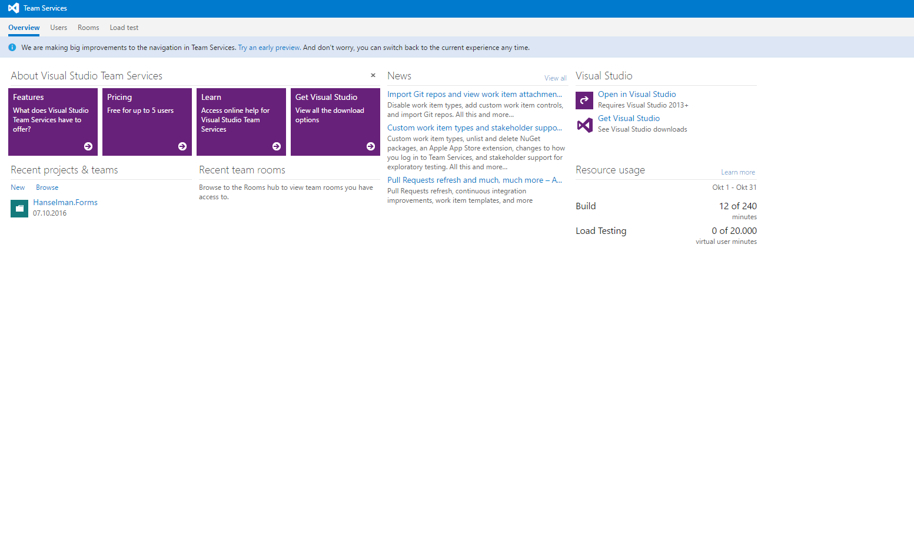

#### Users
User management of the *VSTS* account.
* List all users and their access level.
* Create and edit users and their access level.
* Export users as csv.

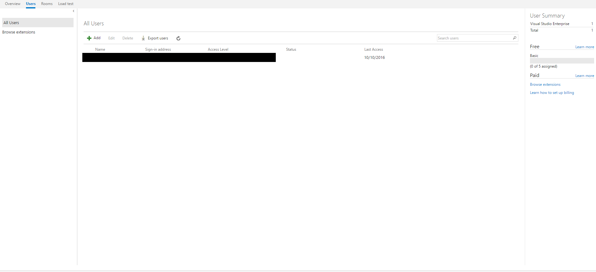

#### Rooms
View of the team rooms management of the *VSTS* account. Team rooms are automatically created for each project to discuss issues and share the status.

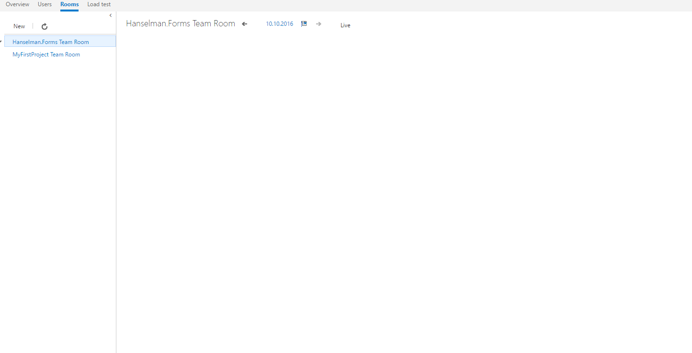

#### Load Tests
View of the load test management of the *VSTS* account. Create, edit and start cloud-based load testing for your web projects. 20.000 minutes each month are free. See [Getting started with Performance testing](https://www.visualstudio.com/docs/test/performance-testing/getting-started/getting-started-with-performance-testing) for more information.

## Create Team Project in VSTS

Choose a project name and a description to specify your app. In our case, we choose **Hanselman.Forms**. There are three process template to choose:

1. Agile
2. CMMI
3. Scrum

Choose the process that fits best for your team (see [Guidance](https://www.visualstudio.com/it-it/docs/work/guidance/choose-process) for more information).
Finally choose a version control system, we use **Git**.

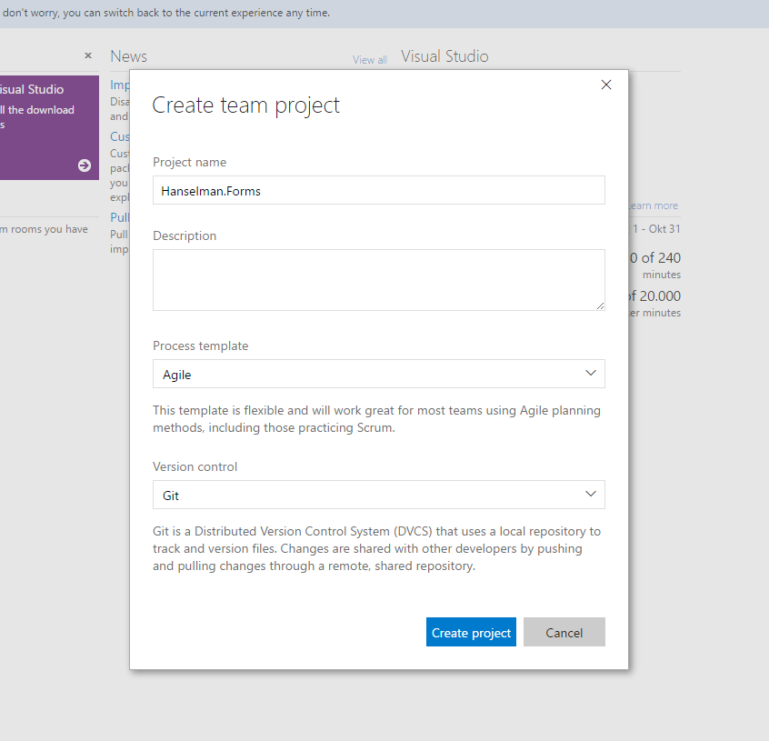

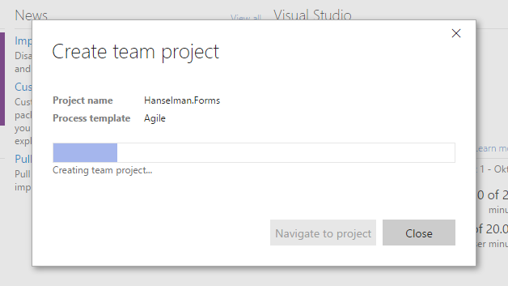

## Import data from GitHub
In this example we use the code from an external GitHub repository, so we have to import this code. Click on **Code**, **Import repository** and add the following link: [https://github.com/jamesmontemagno/Hanselman.Forms.git](https://github.com/jamesmontemagno/Hanselman.Forms.git);

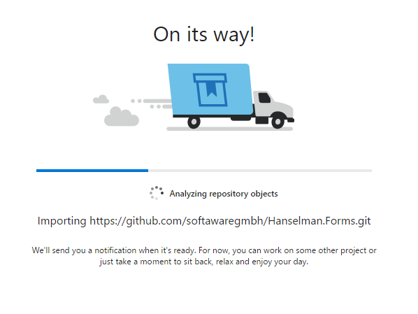

The code should appear in the *VSTS* repo after the import completed. You can clone from the *VSTS* repo at any time.

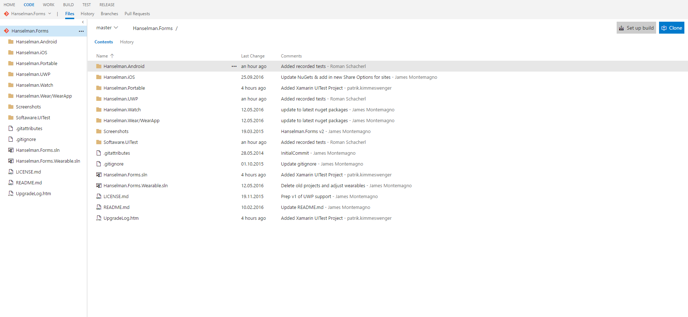

## Build Automation
1. Without changing any code we can configure our automated build with *VSTS*. 
1. Switch to the **BUILD** view. This view provides an overview of all build definitions and their current status.
1. Create a new build definition by clicking on the **NEW DEFINITION** button.
    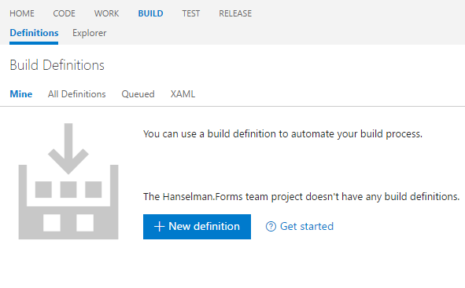

1. In the opened dialog you can choose a predefined build template. The templates are grouped in two tabs: Build and Deployement. Choose **Build**
1. Choose the **Xamarin.Android** Build template.
    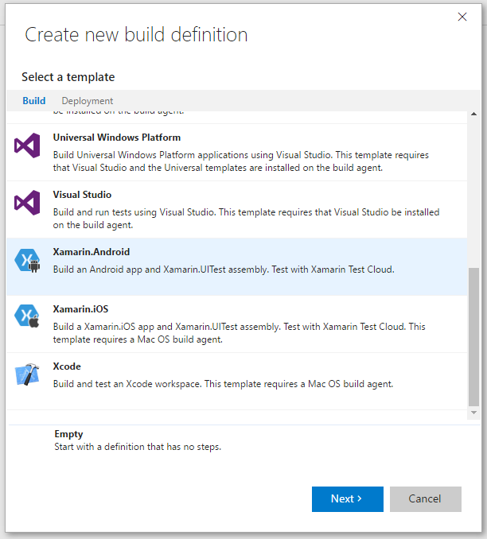
1. Click on **Next**
1. Choose the created repository of your *VSTS* and choose the master branch as default branch. 
1. Activate the option *Continous integration* to start the build whenever the selected branch is updated. 
1. Choose **Hosted** as your default agent queue. The hosted version has 240 build minutes for free. More information can be fround [here](https://www.visualstudio.com/en-us/docs/build/admin/agents/hosted-pool). 
1. Click on the **Create** button to finish this step.

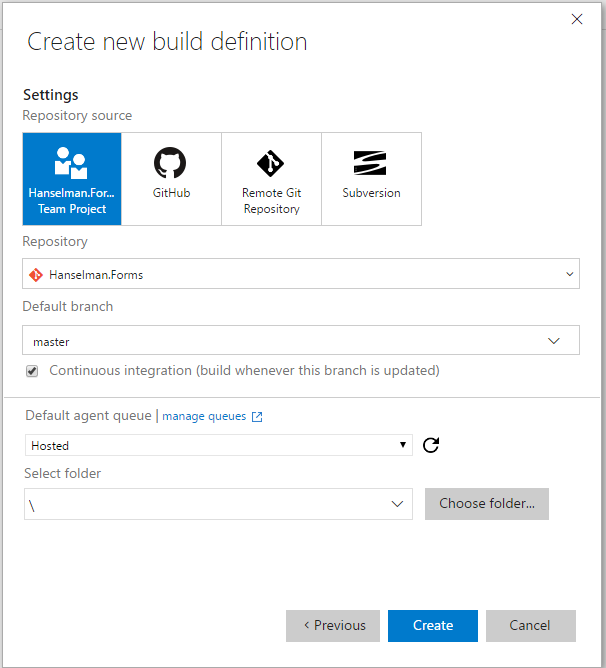

You see two columns in your build definition settings: The build steps are listed in the left section, the settings of the selected build step are on the right side.

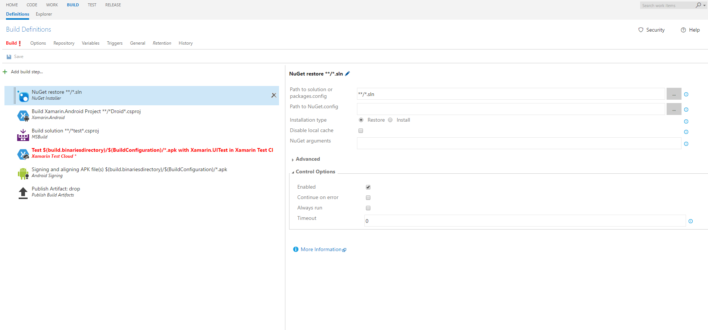

1. Discuss the several steps in the build template
1. Disable the **Xamarin Test Cloud - Test** step: Select the step and deselect the **Enabled** checkbox in the **Control options** section. We'll add test automation later.
1. Click on **Queue new build**, confirm the opened dialog without changing anything and watch the logging information.

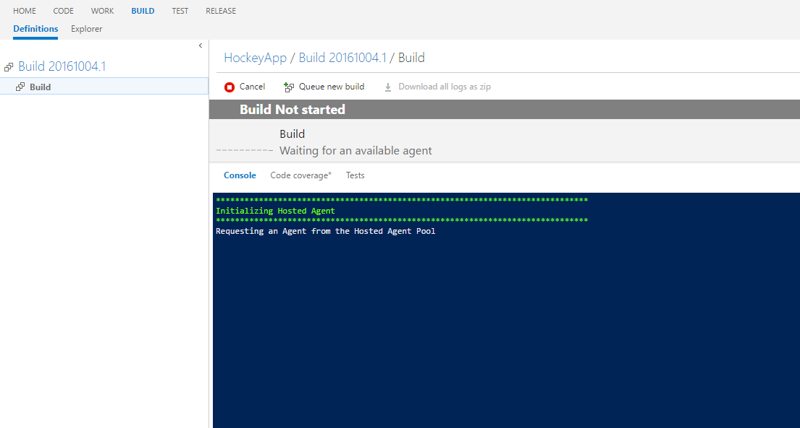

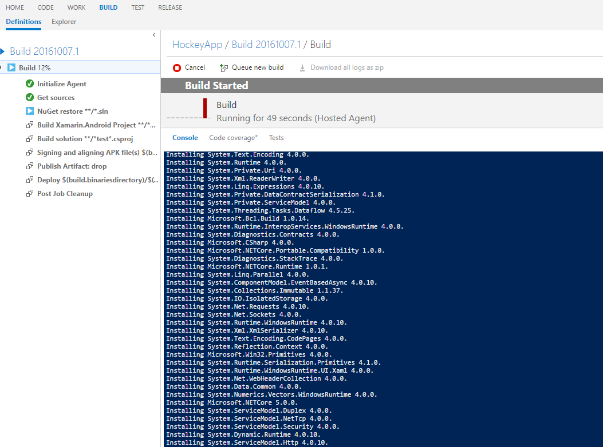

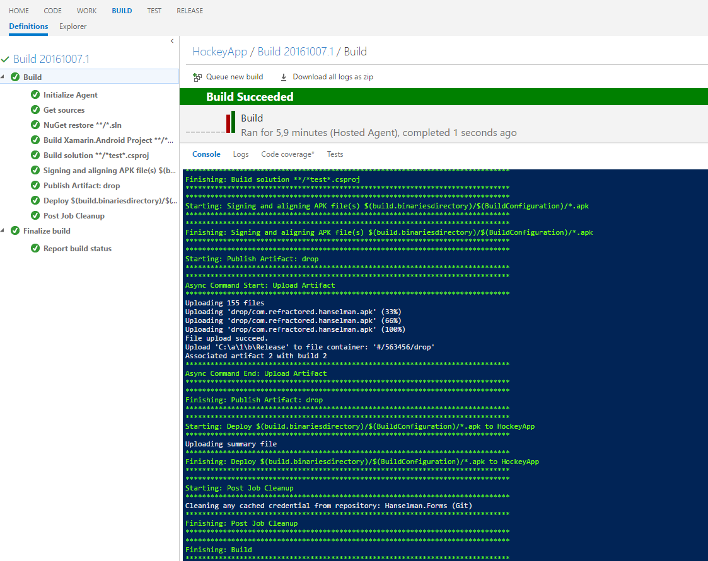
