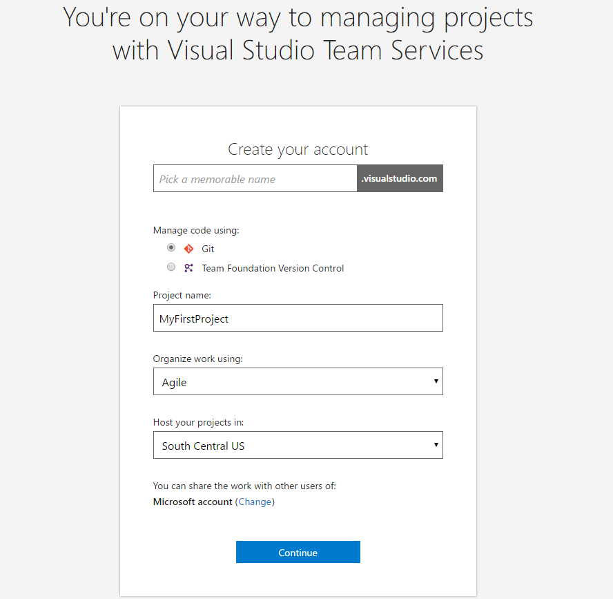

# Visual Studio Team Services and Xamarin

## Learnings

1. Create Team Service account
1. Create Team Service Project
1. Import Code from GitHub into Project
1. Build automation of project in VSTS

## Create Team Service account

Go to offical [Visual Studio Team Service](https://www.visualstudio.com/de/team-services/) page and create an account for free. Login with your existing microsoft account or create a new one.
A name for your *VSTS* and additionall information to your first project (created on account creation) have to be entered.

After login there is an overview of your existing projects (should be only one after creating a new account). The navigation area is on the top left and there are four navigation points:

1. [Overview](#overview)
2. [Users](#users)
3. [Rooms](#rooms)
4. [Load Tests](#load_tests)

#### Overview
Dashboard with good starting information about the *VSTS* account.
* Quick look over all of your projects.
* Create and link to the projects.
* Some helping information
* VSTS News
* Build and load testing stats

#### Users
View of the user management of the *VSTS* account.
* List all users and their access level.
* Create and edit users and their access level.
* Export users as csv.

#### Rooms
View of the team rooms management of the *VSTS* account. Team rooms will automatic created for each project. In team rooms the team cann disqus issues and work in progress and share their status.
* List all rooms and.
* Create and edit rooms.

#### Load Tests
View of the load test management of the *VSTS* account. Create, edit and start cloud based load testing for your web projects. 20.000 minutes each month are free. For more [information](https://www.visualstudio.com/docs/test/performance-testing/getting-started/getting-started-with-performance-testing).

## Create Team Project in VSTS

Choose project name and description to specify your app. In our case, we choose *Hanselman.Forms*. There are three process template to choose:

1. Agile
2. CMMI
3. Scrum

Choose the process that provides the best fit for your team. [For more information](https://www.visualstudio.com/it-it/docs/work/guidance/choose-process).
At the end you have to choose the version control system. There are two options to choice.

## Import data from GitHub
After project creation, their is also an empty repository with same name as the project created. In this example we use the code from an external GitHub repository. So we have to import this code. You can do this in the area *Code*. Click the button **Import repository** and add the following link: [https://github.com/jamesmontemagno/Hanselman.Forms.git](https://github.com/jamesmontemagno/Hanselman.Forms.git);

The code should appear in the *VSTS* repo after the import completed. Now cloning from the *VSTS* repo is possible at any time.

## Build Automation
Without changing any code we can configure our automated build with *VSTS*. For this exercie you have to change to the **BUILD** view. This view provides an overview of all build definitions and their current stati.

Create a new build definition by clicking on the **NEW DEFINITION** button.

In the opened dialog you can choose a predefined build template. The templates are grouped in two tabs:

1. Build
2. Deployement

In our case the **Xamarin.Android** Build template is the one to choose. Globally, if there is an template for your project type, use it and change it later. If there isn't one choose an empty template.

After clicking **Next** settings have to definied. Choose the created repo of your *VSTS* and choose the master branch as default branch. The option *Continous integration* starts the build whenever the selected branch is updated. Choose this option if this is the right choice for your build definition. In this example we use this feature and select the checkbox. With the default agent queue selection you can choose the correct agent for building. The hosted version has 240 build minutes for free. More [information](https://www.visualstudio.com/en-us/docs/build/admin/agents/hosted-pool). Click on the **Create** button to finish this step.

The view of the build definition settings is bisected. The build steps are listed in the left section and the right section is for the settings of the selected build step.

The selected build template is nearly perfekt for our project. The only change is, you have to disable the **Xamarin Test Cloud - Test** step. To do this, select the step and deselect the **Enabled** checkbox in the **Control options** section.

[comment]: <> (Die steps näher erklären?!)

Now the changed can be saved and the first build should be done. Click on the **Queue new build** button, confirm the opened modal without changing anything and watch the log on the next view you get automatic after starting the build.

