# HockeyApp Integration - Build and User Feedback

## Learnings

1. [Register to HockeyApp](#register-to-hockeyApp)
1. [Connection between VSTS and HockeyApp](#connection-between-vsts-and-hockeyapp)
1. [Build integration](#build-integration)
1. [HockeyApp integration in project](#hockeyapp-integration-in-project)
1. [Release Management in VSTS](#release-management-in-vsts)

## Register to HockeyApp
1. Go to the [HockeyApp](https://www.hockeyapp.net/) page
1. Sign up for free (Button top right)
1. Enter your data
1. Select the **I'm a developer** checkbox
1. Click on the **Register** button to sign up.

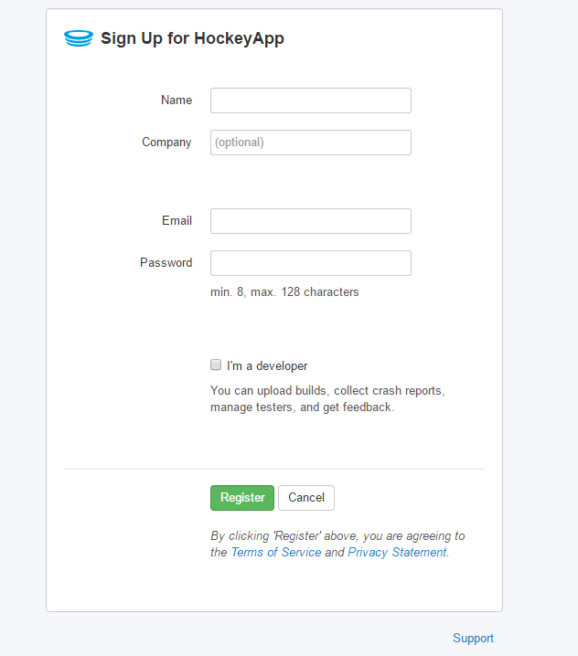

After signing up login to the created account to create a new app. In the first dialog choose **create the app manually instead**.<br/>

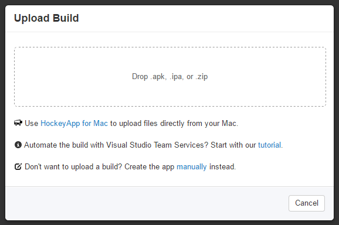

1. Select the platform (*Android*),
1. the release type (*beta*),
1. the title (*Hanselman.Forms*) and
1. the bundle identifier (*com.refractored.hanselman* - see AndroidManifest.xml)

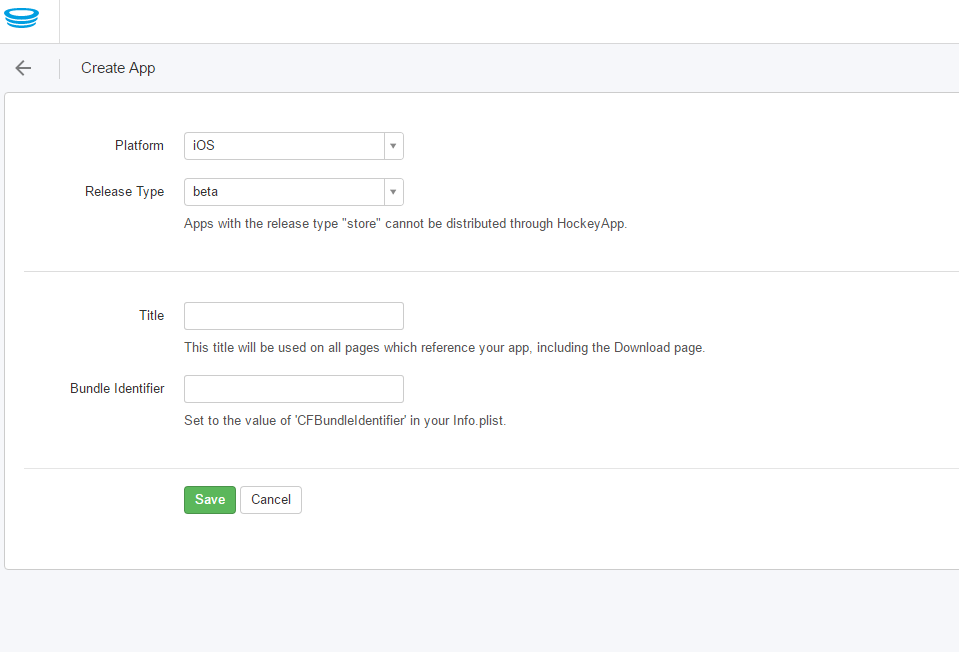

Click on **Save** to create the app.


## Connection between VSTS and HockeyApp
1. Click on **Manage App** to go to the settings page.
2. Click on **Visual Studio Team Services**.
3. Click on **Configure**, enter your *VSTS* login infos and authorize the connection.


Choose the correct *VSTS* project and check **Auto Create Ticket** on **Crash Groups** and **Feedback**.

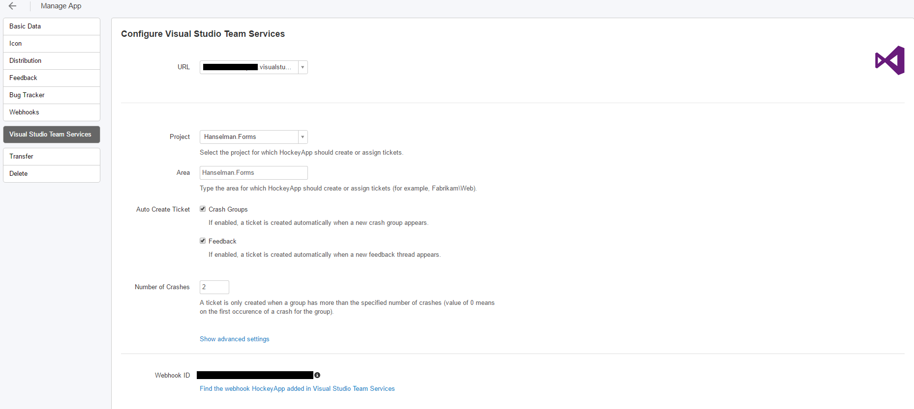

## Build integration
Next step is to integrate *HockeyApp* in the build automation process created in [**exercise 2**](exercise2.md). For build integration *VSTS* needs an api key of our *HockeyApp* account. Create this key in the **Account Settings** - **API Tokens** and copy it to the clipboard.


Install the **HockeyApp-Extension** from the **VSTS Marketplace.**


1. Open the created build definition and click on **Edit**.
1. Add new build step
1. Select the before installed **HockeyApp-Extension** (category "Deploy")
1. Click on close to add the selected task

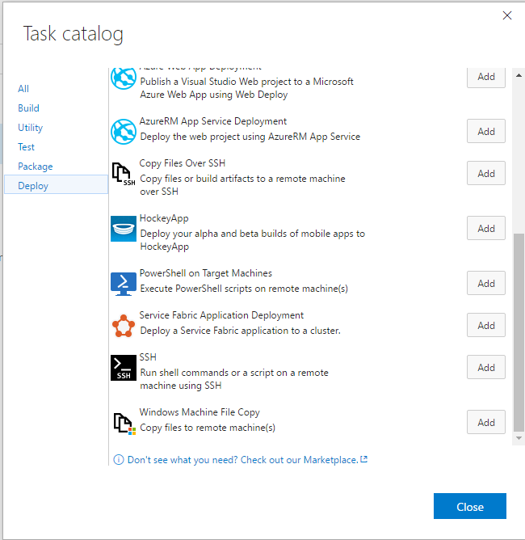

The added task needs a **HockeyApp Connection**.
1. Click on **Manage**, right beside the **HockeyApp Connection** input
1. Add new service endpoint
1. Choose **HockeyApp**
1. Input the name = "Sample.Hanselman.Forms"
1. Paste the *Api-Key* from clipboard

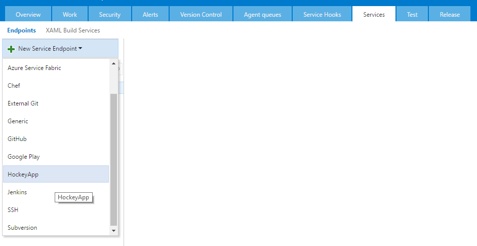

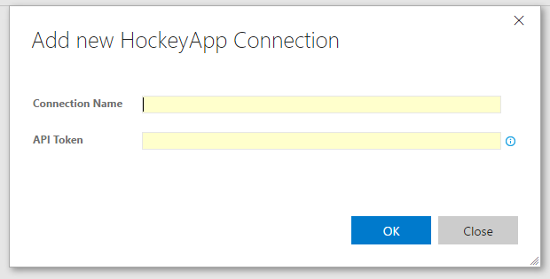

Back to the build definition (after refreshing) the "Sample.Hanselman.Forms" connection should appear. Save the build definition and queue a new build. After build succeeded the apk-File should appear in *HockeyApp*.

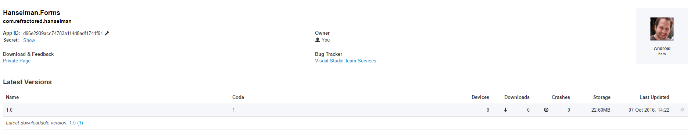

## HockeyApp integration in project

### Crash Reporting
1. Add NuGet package to the Android project: [HockeySDK.Xamarin ](https://www.nuget.org/packages/HockeySDK.Xamarin/)
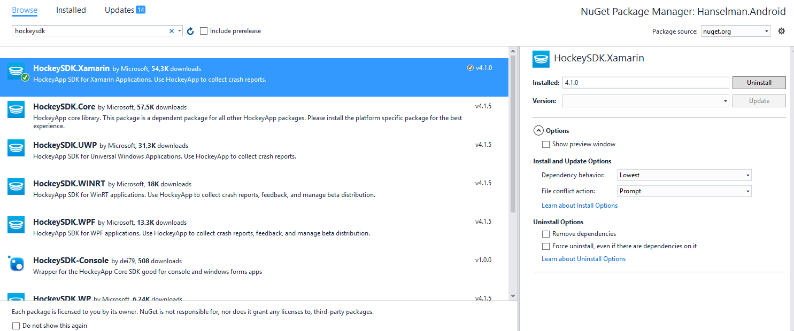

1. Add code to Properties/AssemblyInfo.cs
```cs
[assembly: MetaData("net.hockeyapp.android.appIdentifier", Value = "YOUR_APP_ID_FROM_HOCKEY_APP")]
```

1. Add code to **MainActivity**
```cs
CrashManager.Register(this);
```

### User Metrics
User Metrics is not automatically gathered, you have to start this manually. Add following code to **MainActivity**:
```cs
using HockeyApp.Android.Metrics;

MetricsManager.Register(Application);
```

### Custom Events
**Please note**: To use custom events, please first make sure that User Metrics is set up correctly, e.g. you registered the MetricsManager:

```cs
HockeyApp.MetricsManager.TrackEvent("Custom Event");
```

### User feedback integration in project
This will add the ability for your users to provide feedback from right inside your app.

```cs
FeedbackManager.Register(Application);

var feedbackButton = FindViewById<Button>(Resource.Id.feedback_button);

feedbackButton.Click += delegate {
    FeedbackManager.ShowFeedbackActivity(ApplicationContext);
});
```

## Release Management in VSTS
**Target:** Two independent environments, one for development and one for production. The development version should deploy automatically to *HockeyApp* and the production version should deploy automatically to *Google Play Store*.

### 1. Environment: HockeyApp
1. Go to release view in *VSTS*
1. Click on **New Definition**


1. Select empty definition
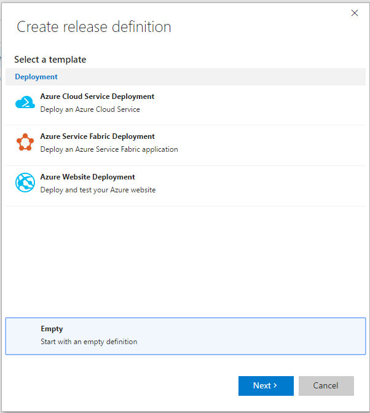

1. Select build (Build with Tests, but without HockeyApp auto deployment), project: 'Hanselman.Forms' and build definition: 'Build'. If desired use *continuouse deployment*. Select the default *Hosted* agent queue and click on the **Create** button.


1. Change name to 'Android'
1. Change name of first, auto generated environment to 'HockeyApp'
1. Add deployment task **HockeyApp**, add **HockeyApp Connection** and set **Binary File Path** to
```cs
build/**/*.apk
```
1. Go to Artifacts tab, change name of source alias to **build**
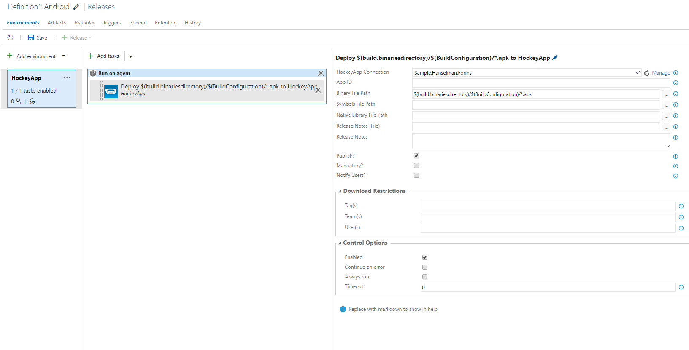

1. Save and start new release to test current settings
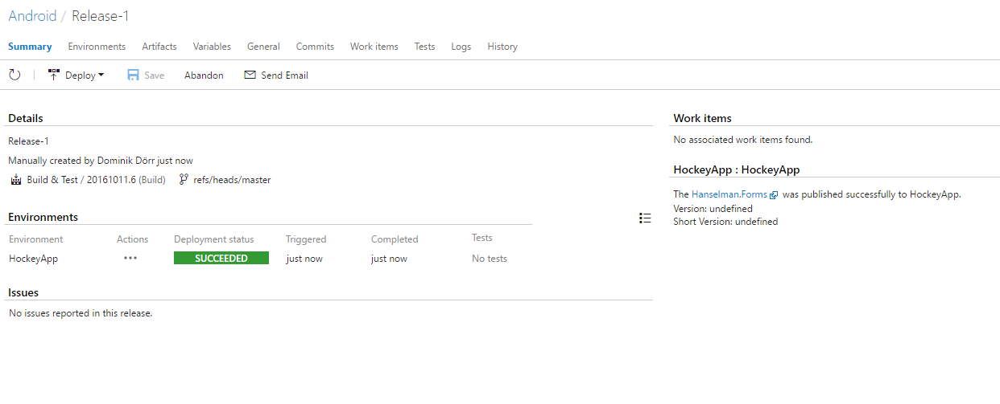

### 2. Environment: Google Play Store
1. Add a new environment
1. Select empty definition and choose a user from your project team in the pre-deployment approval. Activate the auto deployment trigger and select the default hosted queue.
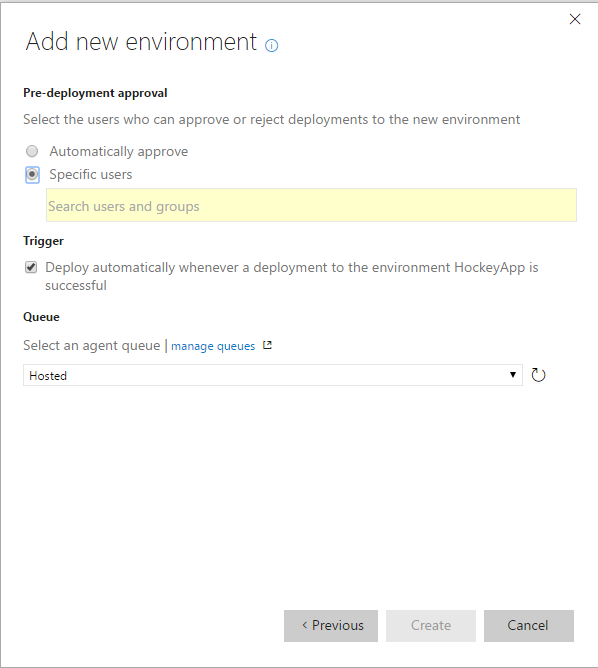

1. Change name of created environment to **Google Play Store**
1. Add new task and click on **Don't see what you need? Check out our Marketplace.** to get to the marketplace.
1. Search for **Google Play** and install the extension.
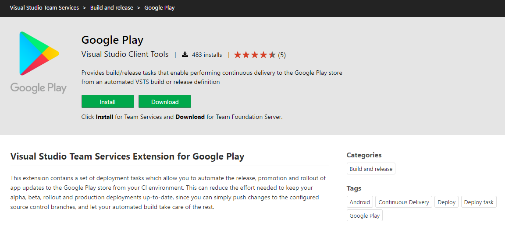

1. After installation, select the new deploy task **Google Play - Release**, add it and close the dialog.
1. Add a new **Service Endpoint** for your **Google Play developer account** and select it.
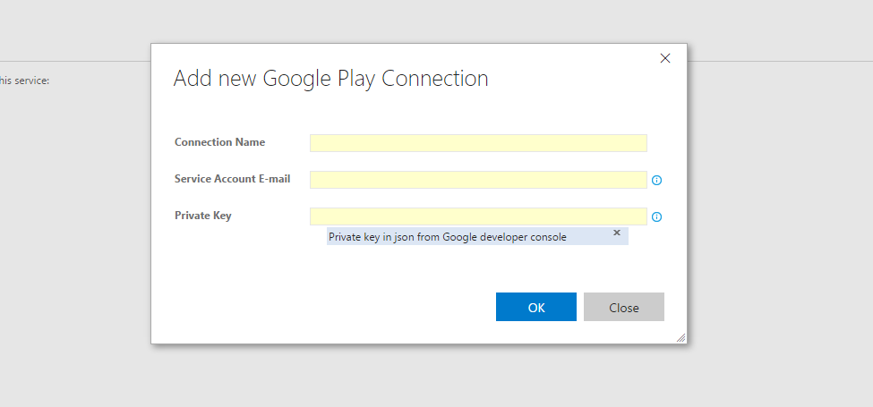

1. Set **APK Path** to and click on save
    ```cs
    build/**/*.apk
    ```

Now the following **Release Management** and **Build** order is configured:
1. New code is checked in
1. Build-Task **Build & Test** started automatically
1. If build succeeded, release management starts **HockeyApp - Deployment** and new version can be tested
1. After testing, new version has to be approved
1. When all specified users have approved the new version, release management starts deployement to **Google Play store** automatically
1. New version is online and all users of the app can update or download the new version
